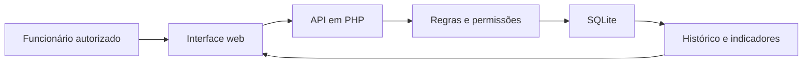

# Casa de Rações · gerenciamento de estoque

Projeto de **Monithelle** para reunir produtos, movimentações e indicadores de estoque em uma aplicação web com acesso por funcionários autorizados. Desenvolvido com apoio de IA, a partir dos requisitos e decisões do responsável pelo projeto.

Este repositório apresenta o trabalho e o processo de construção. O código da aplicação é mantido em um repositório privado. Não são publicados dados de operação, contas de acesso ou arquivos da hospedagem.

## O problema

Controlar um estoque exige acompanhar mais que o saldo atual: é necessário saber o que entrou, o que saiu, os custos, os preços e quem registrou cada operação. O projeto reúne essas informações em um painel com seis áreas.

| Área | Funcionalidade |
| --- | --- |
| Resumo | Indicadores gerais e acompanhamento do estoque |
| Produtos | Cadastro, pesquisa, custos e preços |
| Entradas e compras | Registro de compras e ajustes de entrada |
| Saídas e perdas | Registro de vendas, perdas e ajustes de saída |
| Níveis de estoque | Acompanhamento de segurança, mínimo e máximo |
| Relatórios e gráficos | Análise por período e exportação em CSV |

## Regras que orientam o sistema

- Quantidades em unidades inteiras e saldo sem valores negativos.
- Entrada bloqueada quando ultrapassa o estoque máximo.
- Limites de segurança, mínimo e máximo coerentes entre si.
- Custos e preços da operação preservados no histórico.
- Arquivamento de produtos somente com saldo zero, mantendo os registros.
- Permissões de administrador, operador e consulta verificadas no servidor.

## Tecnologias e linguagens utilizadas

### Linguagens da aplicação

| Linguagem | Tipo | Uso no projeto |
| --- | --- | --- |
| **HTML** | Marcação | Estrutura das telas de login e do painel |
| **CSS** | Estilos | Cores, organização visual e adaptação das telas |
| **JavaScript** | Programação no navegador | Interações, formulários e comunicação com a API |
| **PHP** | Programação no servidor | API, autenticação, permissões, regras de estoque e relatórios |
| **SQL** | Consultas e definição de dados | Estrutura, consultas e atualizações do banco SQLite |

### Linguagens dos scripts de apoio

| Linguagem | Uso no projeto |
| --- | --- |
| **PowerShell** | Configuração de acesso, preparação do pacote de publicação e verificações no Windows |
| **Batch do Windows (.bat)** | Inicialização do sistema no computador local |

### Banco de dados, recursos e ferramentas

- **SQLite:** armazenamento dos produtos, movimentações, usuários e auditoria.
- **PDO:** interface do PHP para acesso ao banco de dados.
- **SVG:** formato vetorial utilizado no logo e nos gráficos.
- **Git e GitHub:** histórico de alterações, repositório privado do código e apresentação pública.
- **Alwaysdata:** hospedagem da aplicação PHP.
- **WinSCP com SFTP:** envio dos arquivos à hospedagem.

### Organização da aplicação

## Desenvolvimento e aprendizados

O trabalho passou por levantamento de requisitos, identidade visual, regras de estoque, integração com banco, relatórios, controle de acesso, testes locais e preparação da publicação. As verificações usam dados de teste separados das informações reais.

Consulte [como o projeto foi construído](docs/desenvolvimento.md) para conhecer as responsabilidades de cada etapa.

## Estado do projeto

As funcionalidades principais foram implementadas, e o responsável confirmou o acesso após o envio à hospedagem. A validação completa da configuração de produção, os backups periódicos e o acompanhamento da capacidade são atividades de manutenção. Os testes locais não representam uma garantia de ausência de falhas.

Este projeto não emite documentos fiscais. Os indicadores de margem bruta menos perdas não representam lucro líquido.

Sugestões sobre a apresentação e as funcionalidades podem ser registradas nas issues deste repositório.
